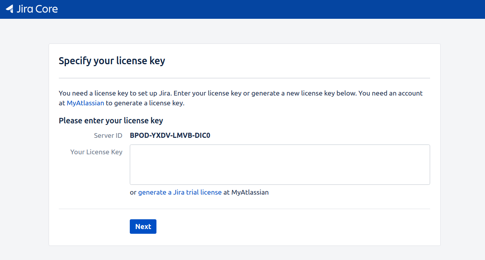
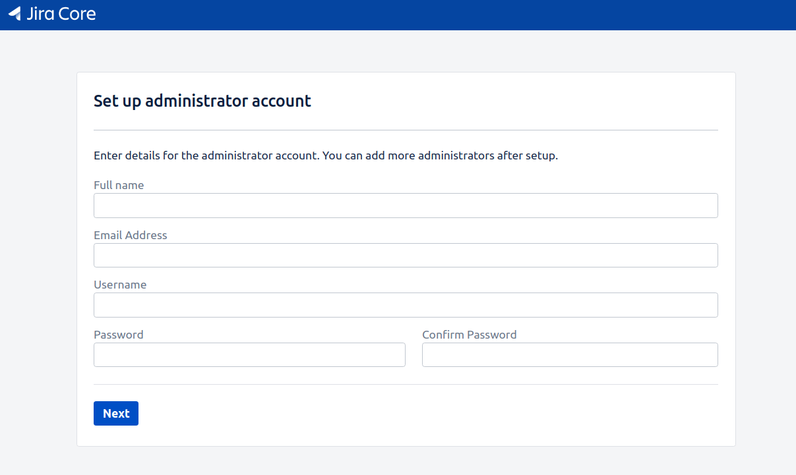

## Jira in docker

### I. Prerequisites, Before Christ
1. With local deployment, we need to add `127.0.0.1 jira.internal` into hosts file:
   ```
   echo '127.0.0.1 jira.internal' | sudo tee -a /etc/hosts
   ```

2. With AWS deployment, simply change docker-compose files by referring `.env`:
   ```
   # comment out for local deployment, uncomment when deploying at AWS
   COMPOSE_FILE=docker-compose.yml:docker-compose.aws.yml
   ```

3. For TLS certificate, pls install letsencrypt certbot first: https://certbot.eff.org/docs/install.html, then:
   ```
   sudo certbot certonly --standalone -d jira.domain.com -m your@email.com --agree-tos -n
   ```

### II. Step by step
1. Build them up:
   ```
   docker-compose up -d
   ```

2. Everything will be automatically configured, until you reach the license prompt screen:

   

3. Copy the license server id, for example `BPOD-YXDV-LMVB-DIC0`, then run command below, with `-p` for product, `-m` for email, `-n` for license name, `-s` for license server id:
   ```
   java -jar atlassian-agent.jar \
	-p jira \
	-m your@email.com \
	-n hino \
	-o akatsuki \
	-s BPOD-YXDV-LMVB-DIC0
   ```

4. Copy the generated license code, get back to your browser and submit it, then BOOM!!! you're done :whale:

   

5. Check what they are doing behind your back:
   ```
   docker-compose logs -f --tail 69
   ```

6. Tired of Jira, burn them down:
   ```
   docker-compose down
   ```

### IV. Frequently Q&A
1. At **step 3**, if **java** is not installed at your machine, use below docker trick:
   ```
   docker run --rm -v "${PWD}/atlassian-agent.jar:/atlassian-agent.jar" \
	openjdk:8-jre-alpine \
	java -jar atlassian-agent.jar \
	-p jira -m your@email.com -n hino -o akatsuki \
	-s BPOD-YXDV-LMVB-DIC0
   ```

2. Be aware that changing postgres default database name (`postgres` -> `jira`), it'll create a new database `jira` and doesn't accept incoming connection during that time. Therefore you may encouter a problem when Jira perform DB pre-database startup check and can not start Jira server. You may need to:
   + Simply restart jira service with: `docker-compose restart jira`
   + Change postgres config `POSTGRES_DB` and `POSTGRES_USER` back to default as `postgres`
   + Implement docker delayed startup config, pls refer: https://docs.docker.com/compose/startup-order/

   For the sake of simplicity, and meaningful DB config, i wont re-config it now, but will track and update if needed.

3. `TODO` - TLS cert autorenew config + fully-automated cert generating :penguin:

4. Last but not least, the Jira crack mechanism is thank to Zhile, you can refer the source and donate to him via: https://gitee.com/pengzhile/atlassian-agent
